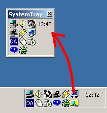



## SystemTray to Window

### Description

The code grabs the SystemTray and place it in a window.
 
### More Info
 
nah...

blah...

none...

             |
---                |---
**Submitted On**   |2000-11-16 12:09:24
**By**             |[Thomas Raben](https://github.com/Planet-Source-Code/PSCIndex/blob/master/ByAuthor/thomas-raben.md)
**Level**          |Advanced
**User Rating**    |4.9 (34 globes from 7 users)
**Compatibility**  |VB 5\.0, VB 6\.0
**Category**       |[Windows API Call/ Explanation](https://github.com/Planet-Source-Code/PSCIndex/blob/master/ByCategory/windows-api-call-explanation__1-39.md)
**World**          |[Visual Basic](https://github.com/Planet-Source-Code/PSCIndex/blob/master/ByWorld/visual-basic.md)
**Archive File**   |[CODE\_UPLOAD1173411162000\.zip](https://github.com/Planet-Source-Code/thomas-raben-systemtray-to-window__1-12829/archive/master.zip)

### API Declarations

Some...

